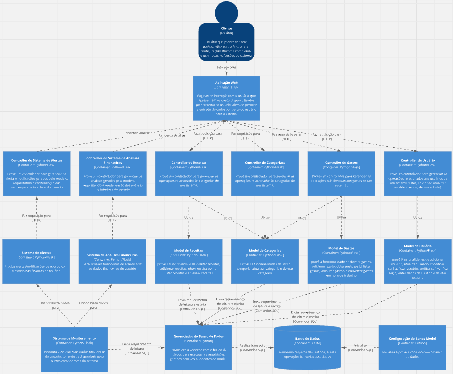

Software Engineering class at Campinas University - UNICAMP

Introduction to Software Engineering and Sociotechnical Vision. Software Processes. Software Configuration Management. Requirements Engineering. Software Systems Analysis and Design. Software Testing. Software Release.

# Projeto_MC656

MC656 final project

Our project is a educational system for personal finance. It will contain dashboards wich helps our user to keep up with his expense, also prevents with articles and vídeos so people can learn continuosly. Being that way, our user will have more controll over his money, and have a healthier financial life.

Participants:

Thiago Nadim Martinho ra:239426

Lucas Félix ra:247064

Isac Lucas Soares Braga ra:260514

Rafael Masato Haga Costa ra:247348

Daniel Henriques Pamplona ra:260401

## Arquitetura do Projeto

Diagrama C4 - nível de componente 

)

O diagrama da aplicação é composto pelos seguintes componentes:

- Cliente: Usuário que poderá ver seus gastos, adicionar salário, alterar configurações da conta como email e usar todas as funções do sistema.
- Aplicação Web: Páginas de interação com o usuário que apresentam os dados disponibilizados pelo sistema ao usuário, além de permitir a entrada de dados por parte do usuário para o sistema.
- Controller do Sistema de Alertas: Provê um controlador para gerenciar os alerta e notificações gerados pelo modelo, requisitando a renderização das mensagens na interface do usuário
- Controller do Sistema de Análises Financeiras:Provê um controlador para gerenciar as análises geradas pelo modelo, requisitando a renderização das análises na interface do usuário
- Controller de Receitas: Provê um controlador para gerenciar as operações relacionadas às categorias de um sistema.
- Controller de Categorias: Provê um controlador para gerenciar as operações relacionadas às categorias de um sistema.
- Controller de Gastos: Provê um controlador para gerenciar as operações relacionadas aos gastos de um sistema .
- Controller de Usuário: Provê um controlador para gerenciar as operações relacionadas aos usuários de um sistema (listar, adicionar, atualizar usuário e senha, deletar e login).
-  Sistema de Alertas: Produz alertas/notificações de acordo com o estado das finanças do usuário
- Sistema de Análises Financeiras:Gera análises financeiras de acordo com os dados financeiros do usuário
- Model de Receitas   :provê a funcionalidade de deletar receitas, adicionar receitas, obter receita por id, listar receitas e atualizar receitas        
- Model de Categorias: Provê as funcionalidades de listar categoria, atualizar categoria e deletar categoria.
- Model de Gastos: provê a funcionalidade de deletar gastos, adicionar gasto, obter gasto po id, listar gastos, atualizar gastos, e converter gastos em hora de trabalho
- Model de Usuário: provê funcionalidades de adicionar usuário, atualizar usuário, modificar senha, listar usuário, verifica cpf, verifica login, obter dados de usuário e deletar usuario
- Sistema de Monitoramento: Monitora e centraliza os dados financeiros do usuário, tonando-os disponiveis para outros componentes do sistema
- Gerenciador do Banco de Dados: Estabelece a conexão com o banco de dados para executar as requisições geradas pelos componentes do model.
- Banco de Dados:Armazena registros de usuários, e suas operações bancarias associadas
- Configuração do Banco Model: Inicializa e provê a conexão com o banco de dados

A estrutura geral do nosso projeto segue o estilo arquitetural **MVC** (Model-View-Controller), que organiza os componentes em três camadas independentes:

- **Model**: É a camada onde está concentrada a lógica central do sistema, responsável pelo processamento de informações e pela solução do problema abordado. Além disso, gerencia as transações com o banco de dados, realizadas por meio de um componente dedicado.
- **View**: Representa a camada responsável pela interação direta com o usuário, tanto para captar eventos (como o envio de dados) quanto para exibir informações relevantes na interface.
- **Controller**: Atua como intermediário entre o Model e a View, facilitando a comunicação entre essas camadas. Ele recebe as requisições geradas pela View (por meio do protocolo HTTP), e as encaminha, juntamento com os dados, para o Model, que então processa a requisição e devolve para o Controller os dados a serem exibidos pelo View, ou anida gera um uma requisição para o banco de dados para armazenar as informações processadas.

Na implementação do projeto, o estilo arquitetural está sendo predominantemente utilizado como uma forma de gerenciar a interação entre o usuário e o banco de dados. Por exemplo, no cadastro de gastos, o usuário insere na interface (*View*) os dados correspondentes a um gasto qualquer (com data, categoria e valor), e no momento em faz a submissão dessas informações uma requisão é gerada para o *Controler*, que encaminha a solicitação para o *Model* referente aos gastos que então armazena o gasto inserido no banco de dados em uma tabela dedicada. Ou ainda, o *View* gera uma requisição para recuperar algum dado específico armazenado, a requisição passa pelo *Controller* e chega a *Model* que se comunica com o banco de dados e retona as informações recuperadas para *Controller*, que então faz o encaminhamento para a disposição de informações no *View*, este fluxo ocorre, por exemplo, para listagem na tela dos gastos registrados anteriormente pelo usuário.

Adicionalmente, o estilo arquitetural de **Shared Repository** foi implementado para possibilitar a comunicação entre diferentes módulos do sistema por meio de um banco de dados compartilhado. Em nosso projeto isso é especialmente relevante para a integração do módulo de monitoramento, que analisa as informações financeiras do usuário e gera notificações/análises com base nesses dados, com o módulo responsável por capturar e armazenar as informações fornecidas pelo usuário.
